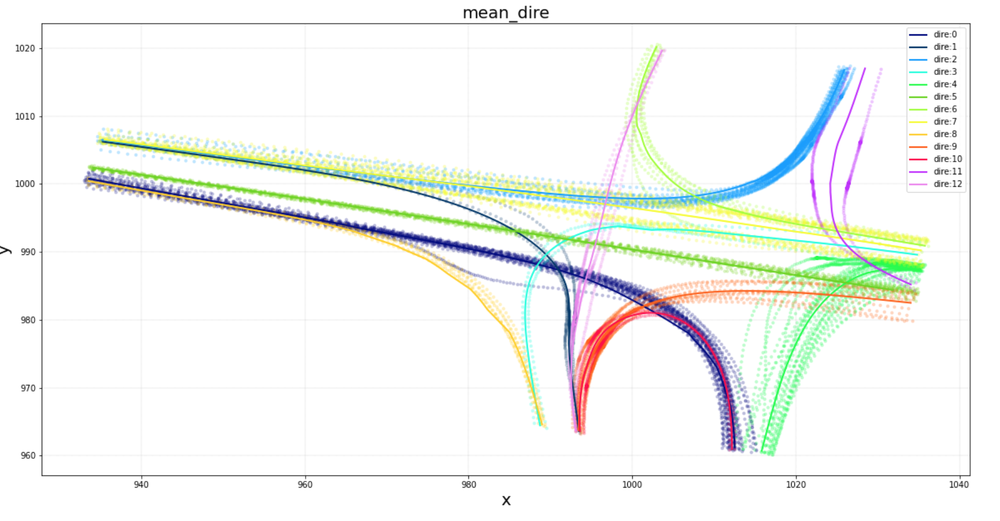

# Traffic-Analysis

:warning: [Work in progress]

**The purpose of the trajdect package is to analyze the data from the data set INTERACTION-Dataset-TC-v1_0**

you can view all csv using this [tool](https://github.com/interaction-dataset/interaction-dataset)

In this document we use the term 'trajectory' to define all the positions taken by a single vehicle.
The term 'direction' denotes a set of trajectories that have the same entry and exit point.

four main function has been defined: 
- [directions](#directions) 
- [slowdowns](#slowdowns)
- [intersections](#intersections)
- [crossovers](#crossovers)

## directions:

`df, df_dire, lost_rate = trajdect.directions(df, dire_type = 'mean_dir', max_frame=None, min_frame=None)`

Direction takes as input df, df is the data frame from the .csv of the data_set INTERACTION-Dataset-TC-v1_0.
It is possible to use more than one .csv at the same time. In this case, you have to merge them and renumber the `track_id` column so that there is no repetition within the df.
If you want to use a df composed of several .csv, you will have to give as input `max_frame`, a list with the maximum frame of each .csv and `min_frame`, composed of the minimum frame of each csv.

This function will: 
1. assign to each vehicle the direction it belongs to according to its trajectory and add it to df.
2. define the positions for each direction, and store them in df_dire. Two functions are available:
    - mean_traj will compute an average of all trajectories (more representative of all trajectories but slower to compute)
    - first_traj will take the first trajectory (fast to compute but not very representative of all trajectories)
3. lost_rate: the rate of vehicles present in the initial df but which were not taken into account. there are two reasons why they were not taken into account:
    - their entry point was on the first frame or their exit point was on the last frame.
    - the clustering algorithm failed to classify their entry or exit point.

exemple with DR_USA_Intersection_GL/vehicle_tracks_022.csv, mean_traj, all the direction plot, all the trajectories scatter:

## slowdowns:

`df_slowdown = trajdect.slowdowns(df, direction, slow_rate, discr=20)`

This function allows us to detect slowdowns in a direction.
It calculates the average speed over n=`discr`^2 zones spread over all the trajectories that have the same direction.
For each vehicle at any moment we look at which zone it belongs to and compare its speed with the average speed (v_mean) of the zone it belongs to.
If speed<`slow_rate` * avg_speed we consider this vehicle to be unusually slow and classify it as slowdowns

It takes as input:
 - `df`: with the direction on each vehicle (obtained with `trajdect.direction`)
 - `direction`: la direction sur la quel on veut trouver les ralentissement
 - `discr`: qui va definir le nombre de zone calculé (discr^2)
 - `slow_rate`: le ratio a partir du quel une vitesse est considéré comme un ralentissement (plus slow_rate est grand plus on trouvera de ralentissement)

and will compute `df_slowdown` wich contains:
- the identification of the vehicle `track_id`
- the speed at which he goes during the slowdown.
- the average speed at which the other vehicles in that zone are travelling `v_mean`.
- the moment at which it is considered that the vehicle is starting to be too slow `t_min`.
- the moment the vehicle resumes normal speed `t_max`.

As an exemple we have merged all the csv of the DR_USA_Intersection_GL data set. We have compute all the direction and then all the slowdowns of every direction with `discr` = 20 and `slow_rate` = 0.5.
You can find the result [here](DR_USA_Intersection_GL_slowdown_slow_rate=0.5_discr=20)

## intersections:

`df_inter = trajdect.intersections(df_dire, tol_rate=1.5, rmax=2)`

The purpose of this function is to find the interactions between the different directions.
The interactions are classified into three types:
1. `None`: no interaction between the two trajectories.
2. `junction`: the trajectories merge at a certain point
3. `crossover`: trajectories cross each other 

intersections take as input : 
- `df_dire`: compute with `trajdect.directions`.
- `tol_rate`: represents the acceptable distance between two directions to consider an interaction. The greater tol_rate, the more interactions will be detected. (which may be false)
- `rmax` represents the radius at which an interaction is considered to be a junction. If rmax is very large, all interactions will be classified as crossover.

it may be interesting to vary tol_rate and rmax according to each case to be better adapted to the situation.

and will compute `df_inter` wich contains: 
- the first direction `direction 1`
- the second direction `direction 2` 
- the point of interaction, if applicable `center`
- the radius in case of an intersection `radius`
- the type of intersection: `crossover`, `junction` or `None`

Note that to avoid repetition, `direction 1` < `direction 2`

exemple with the df_dire compute above :

## crossovers

`df_crossover = trajdect.crossovers(df_inter, df, dist_cross = 10)`

the purpose of this function is to detect, if two vehicles belonging to two intersecting trajectories, approach the intersection at the same time.

crossovers takes as input:
- `df_inter`: compute with `trajdect.intersections`
- `df`: with the direction on each vehicle (obtained with `trajdect.direction`)
- `dist_cross`: the maximum distance from which a vehicle is considered to be close to the intersection.

And will compute `df_crossover` wich contains:

- identification of the 1st vehicle `track_id_1`
- the direction to which the first vehicle belongs `direction 1`
- the average speed at which the vehicle is close to the intersection `v_mean_1`
- identification of the 2nd vehicle `track_id_2`
- the direction to which the 2nd vehicle belongs `direction 2`
- the average speed at which the vehicle is close to the intersection `v_mean_2`
- the position of the crossover `position`
- the beginning of the moment they cross `t_max`
- the end of the moment they cross `t_min`

:warning: this fonction cannot work with a df which contain more than one .csv since each .csv as his own timeline
